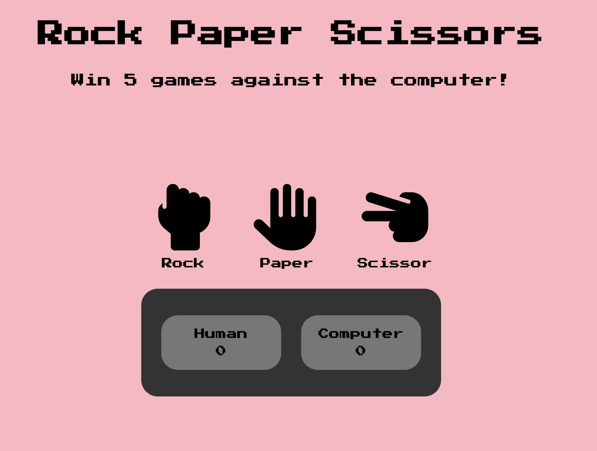

# 🪨📄✂️ Rock Paper Scissors

A fun, interactive Rock-Paper-Scissors game built with **HTML**, **CSS**, and **JavaScript**. Play against the computer—first to 5 points wins!

## 🎮 Gameplay

- Click one of the hand icon buttons: **Rock**, **Paper**, or **Scissors**
- The computer randomly chooses its move
- The first player to reach 5 wins
- After the game ends, click **Play Again** to restart

## 📸 Screenshot



## 🛠️ Technologies Used

- HTML5
- CSS3 (with Google Fonts & Font Awesome icons)
- Vanilla JavaScript

## 🚀 How to Run Locally

1. Clone the repository:
2. Navigate to the project directory
3. Open index.html in your browser or visit the live version of the game [HERE](https://santi-raigoza.github.io/RockPaperScissors/).

## File Structure

```
RockPaperScissors/
├── index.html
├── style.css
├── javascript.js
└── README.md
```

## Author
Created by Santiago Raigoza
